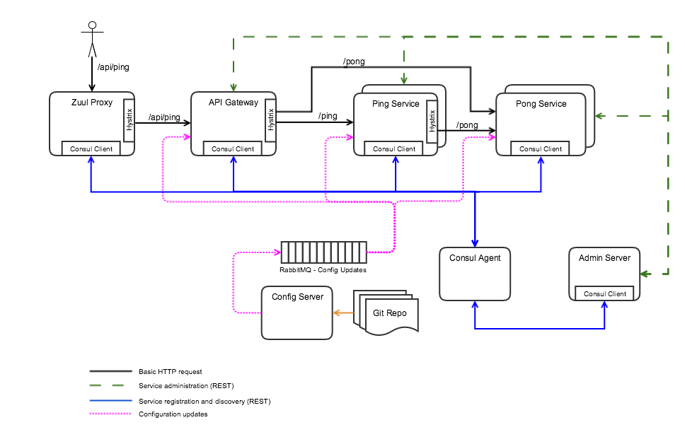
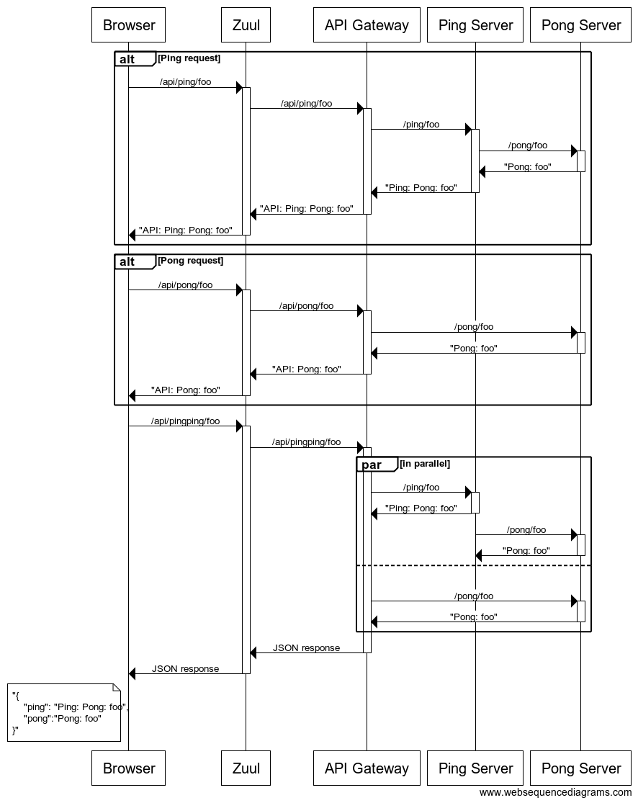

# Spring Cloud + Consul + Netflix POC

This module puts together pieces from Spring Boot + Spring Cloud + Hashicorp's Consul + Netflix OSS.  

In order for the modules/services below to find and communicate with each other they must register with service discovery registry.  For this POC, the service registry is Consul.  A consul agent must be installed and running on the local machine.

You can follow the directions on the [Consul](https://www.consul.io/intro/getting-started/install.html) web page.

The source code for the Consul web UI can also be [downloaded](https://www.consul.io/downloads.html)

You can use the following command line to run locally on OSX.  Consul web UI will be available at http://localhost:8500/ui

`consul agent -server -bootstrap-expect 1 -data-dir /tmp/consul -node localhost -ui-dir /path/to/ui/dist/`

This POC also supports distributed tracing using Spring Cloud Sleuth to instrument activity and [Zipkin](https://github.com/openzipkin/zipkin) to analyze trace data. You will need to run Zipkin on your local machine. The easiest way to do this is with the [Docker Zipkin](https://github.com/openzipkin/docker-zipkin) project. You may need to update global application.yaml file that is used by the [Config Server](./config-server).

The following modules are included:

ping-service
------------
Simple service providing some GET endpoints that take in a message from the URL and return a simple string response.  Ping Service endpoints make additional calls to Pong Service endpoints.

pong-service
------------
Simple service providing some GET endpoints that take in a message from the URL and return a simple string response.  Pong Service just add a prefix to the message and return a simple string response.

api-gateway
-----------
Simple service providing some GET endpoints that proxy the endpoints of the Ping Service and Pong Service.  The API Gateway endpoints have the same URIs as the delegated services with /api prefix on the URI.  Responses are just the responses from the delegated service calls with "API: " prefix added.

config-server
-------------
Spring Boot application running Spring Cloud's Config Server.  This server provides external configuration capabilities to the rest of the services.  Configuration data is managed in a Git repository.

admin-server
------------
Spring Boot application running Codecentric AG's Administration Server that provides status monitoring of all services as well as views of service's environments and the ability to dynamically change the value of service properties.

zuul-server
-----------
Spring Boot application running Netflix Zuul as a reverse proxy.  Runs on port 8080 and routes any request starting with "/api" to the API Gateway service and requests starting with /admin-server to the Admin Server

