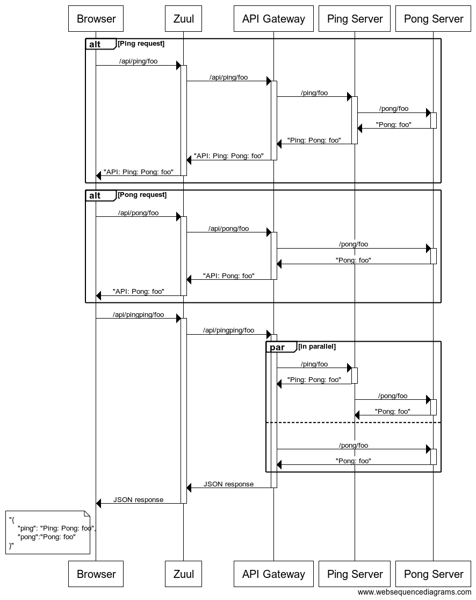

# Spring Cloud + Netflix POC

This module puts together pieces from Spring Boot + Spring Cloud + Netflix OSS.  

The following modules are included:

ping-service
------------
Simple service providing some GET endpoints that take in a message from the URL and return a simple string response.  Ping Service endpoints make additional calls to Pong Service endpoints.

pong-service
------------
Simple service providing some GET endpoints that take in a message from the URL and return a simple string response.  Pong Service just add a prefix to the message and return a simple string response.

api-gateway
-----------
Simple service providing some GET endpoints that proxy the endpoints of the Ping Service and Pong Service.  The API Gateway endpoints have the same URIs as the delegated services with /api prefix on the URI.  Responses are just the responses from the delegated service calls with "API: " prefix added.

eureka-service
--------------
Spring Boot application that runs Netflix Eureka server providing service discovery capability.  

hystrix-dashboard
-----------------
Circuit Breaker Monitoring - Spring Boot application that runs the Netflix Hystrix Dashboard application that is used to monitor the status of circuit breakers in other services

turbine-service
---------------
Spring Boot application that runs Netflix Turbine server that pulls Hystrix statistics from other services and aggregates them into common streams that can be consumed by the Hystrix Dashboard to see a consolidated view of all the circuit breakers.

config-server
-------------
Spring Boot application running Spring Cloud's Config Server.  This server provides external configuration capabilities to the rest of the services.  Configuration data is managed in a Git repository.

admin-server
------------
Spring Boot application running Codecentric AG's Administration Server that provides status monitoring of all services as well as views of service's environments and the ability to dynamically change the value of service properties.

zuul-server
-----------
Spring Boot application running Netflix Zuul as a reverse proxy.  Runs on port 8080 and routes any request starting with "/api" to the API Gateway service. 

